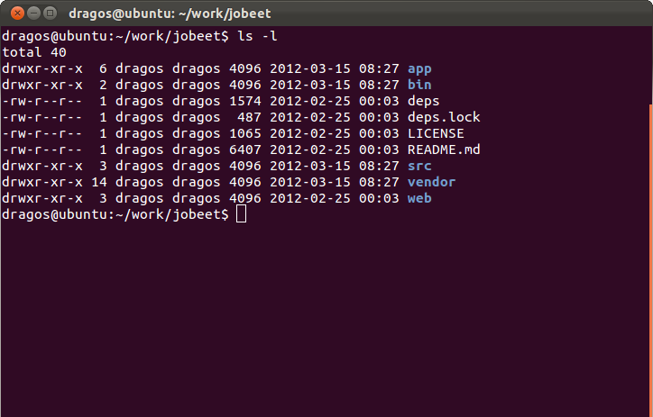
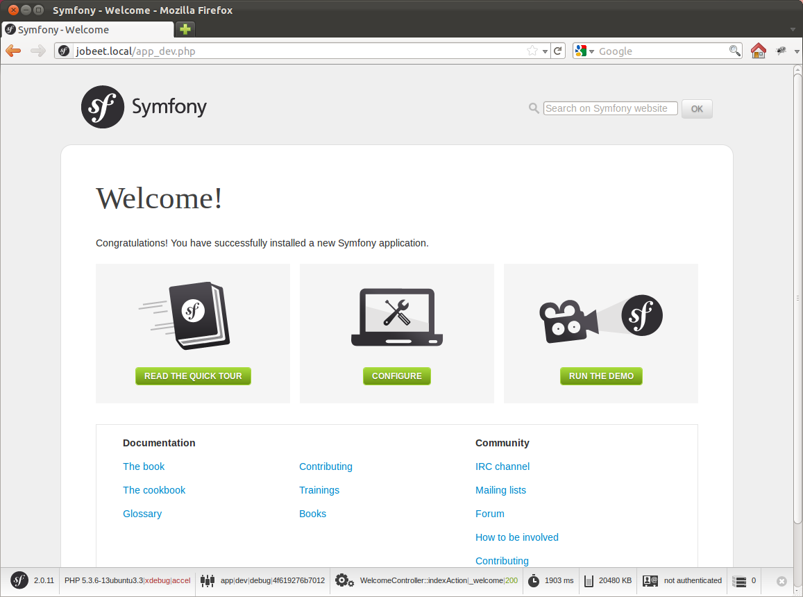

# Symfony2 Jobeet Day 1: 开始项目

今天我们的任务主要是建立开发环境，安装Symfony2并使其成功在浏览器中展示一个demo页面。

为了下面的课程能顺利进行，首先请你确保你的电脑已经具备了一个web开发环境。因此你至少需要有一个web 服务器（例如apache或者Nginx又或是其他），一个数据库（MySQL）和PHP解释器（5.3.2及以上版本）

## 下载并安装Symfony2

在你的web服务器上建立一个新的站点目录，用来安装这个项目。我们将其命名为Jobeet。
打开 *http://symfony.com/download* ，选择"Symfony Standard"并下载（截至作者书写时最新版本为2.0.11）。下载完成之后将其解压到之前你所创建的目录。结构如下图： 
 


> *译者注：上面提供的方法已经失效，自Symfony2.1之后下载通过Symfony Installer进行安装。具体方法可参考官网。或由Composer进行安装（~~其中1.0.0-alpha10有较大bug，会导致无法安装包，请谨慎下载~~ 截至至现在该问题已经恢复正常），由于国内网络众所周知的原因，基本上两者直接下载一次成功的可能性都较小，个人推荐Composer安装。*  

> *小提示：用Symfony Installer安装的时候你会发现有一个临时目录，会将下载的压缩包放于其中，而本身解压需要不少时间，so，你懂的。*

## Composer安装方式

本部分为补充部分，参考[更新Vendors](http://intelligentbee.com/blog/2013/08/07/symfony2-jobeet-day-1-starting-up-the-project/)部分内容，简单介绍一下Composer的安装及使用。

Composer是一个流行的PHP的包依赖管理工具。它允许你声明项目所依赖的代码库，并在你的项目中安装它们。

> *小提示：知道npm吗？不知道？看来你确实OUT了*

它的安装方式非常简单。

*nux下
> **curl -sS https://getcomposer.org/installer | php**

windows下
> **C:\Users\username>cd C:\bin**  
> **C:\bin>php -r "readfile('https://getcomposer.org/installer');" | php**  


> *小提示：上述方式都是将其作为局部安装使用。*

然后就可以用

> **php composer.phar install**

方式安装所需要的依赖包了。
其他关于更详细的信息可以前往[官网](http://docs.phpcomposer.com/)进行查看

> *译者注：我个人更喜欢将php composer.phar建立一个shell或bat文件，这样使用起来更方便。*

## 用composer安装Symfony

输入如下命令即可创建Symfony项目。 其中2.7.0为版本号，不填写时为最新版本。
至译者翻译完成之时最新版本为3.1.0，长期支持版为2.8.0。你可以根据自己的需要来选择版本。

> **php composer.phar create-project symfony/framework-standard-edition test/ 2.7.0**

其中会回答几个问题如下：
> database_host (127.0.0.1):  
database_port (null): 3306  
database_name (symfony):  
database_user (root):  
database_password (null):  
mailer_transport (smtp):  
mailer_host (127.0.0.1):  
mailer_user (null):  
mailer_password (null):  
secret (ThisTokenIsNotSoSecretChangeIt):*098f6bcd4621d373cade4e832627b4f6*  

其中括号中的为默认值，你可以根据自己的实际情况修改。另外需要注意的是最后一个输入一个随机字符串，没有具体要求


## 配置web 服务器

一个好的网站应该使浏览器只能访问web根目录文件夹，其中包括样式表，js和图片。基于此我们将修改一下apache的配置
打开http.conf并填写如下配置：
```apache
<VirtualHost *:80>
    ServerName jobeet.local
    DocumentRoot /home/dragos/work/jobeet/web
    DirectoryIndex app.php
    ErrorLog /var/log/apache2/jobeet-error.log
    CustomLog /var/log/apache2/jobeet-access.log combined
    <Directory "/home/dragos/work/jobeet/web">
        AllowOverride All
        Allow from All
    </Directory>
</VirtualHost>
```

更改完上述配置之后请重启服务器。
这是apache定义虚拟主机的标准方式，根据你的服务器配置及apache的版本不同，配置上可能会略有差异。比如在Ubuntu，你必须在`/etc/apache2/sites-enabled/`文件夹下创建一个与上述内容相同的文件并取名为jobeet。

最后声明一个本地域名jobeet.local。
如果你是Linux用户，请修改`/etc/hosts`文件；
如果你是windows用户，打开`C:\WINDOWS\system32\drivers\etc\ directory\hosts`，添加如下行

> 127.0.0.1 jobeet.local

## 测试Symfony2安装

重启apache，然后在浏览器中输入 `http://jobeet.local/app_dev.php` 。你将会看到如下页面：

 


为了避免后期开发中遇到的各种环境上的问题，请打开 *http://jobeet.local/config.php* 检查您的配置是否达到要求。并确保没有什么大问题列出，同时遵循列出的建议进行修改（如果有的话）。


## Symfony2 命令行
就像Symfony 1.x一样，Symfony2也自带了命令行工具帮助你创建不同的项目。想要查看命令列表可以使用如下指令：

> **php app/console list**

## 创建一个Bundle
正如你所知道的那样，一个Symfony2的项目是由一个个不同的Bundle组成的，而Symfony框架本身也是一个Bundle。因此为我们的应用程序创建一个新的Bundle是第一步，我们可以使用如下命令：

> **php app/console generate:bundle --namespace=Ens/JobeetBundle --format=yml**

生成器会在过程中问你几个问题，这里有问题及相应的答案供你参考（除了一个使用了非默认回答）

> Bundle namespace [Ens/JobeetBundle]: Ens/JobeetBundle  
> Bundle name [EnsJobeetBundle]: EnsJobeetBundle  
> Target directory [/home/dragos/work/jobeet/src]: /home/dragos/work/jobeet/src  
> Configuration format (yml, xml, php, or annotation) [yml]: yml  
> Do you want to generate the whole directory structure [no]? yes  
> Do you confirm generation [yes]? Yes  
> Confirm automatic update of your Kernel [yes]? Yes  
> Confirm automatic update of the Routing [yes]? Yes  

接下来清理缓存


> **php app/console cache:clear --env=prod**  
> **php app/console cache:clear --env=dev**


> *译者注：上面创建Bundle时，新版本将只执行到第四步，后面将会默认完成*

我们能在项目目录下看到`src/Ens/JobeetBundle`这个新的Bundle。
这个Bundle生成器帮助我们生成了一个DefaultController控制器和一个index action。现在你能通过浏览器访问 *http://jobeet.local/* 或 *http://jobeet.local/app_dev.php/* 这两个网址来查看效果。

> *译者注：老版本中应该访问http://jobeet.local/hello/jobeet或http://jobeet.local/app_dev.php/hello/jobeet*

> *译者注：此时还需要将原本作为demo的AppBundle删除，在老版本中(如2.3)可能叫做AcmeDemoBundle。具体方法是首先删除src下的这个Bundle目录，然后AppKernel.php中删除这行的注册，一般格式是$bundles[] = new AppBundle(); 最后删除路由中这行，一般在app/config/routing.yml中，老版本在app/config/routing_dev.yml中。最后清除一下缓存即可完成。*  

> *译者注：在symfony 3.0之后将console文件移动到bin目录下，操作不变*

## 环境

与Symfony 1.x相比，Symfony2也有它自己不同的环境。如果你打开这个项目的web目录，将看到app.php 和app_dev.php这两个php文件。他们称之为前端控制器。应用程序的所有请求都将通过他们。app.php文件适用于生产环境，而app_dev.php则被用来在web开发人员进行工作时使用。开发环境被证明是非常方便的，这是因为它会告诉你所有的错误和警告，同时会有一个Web调试工具栏————开发人员最好的朋友。

OK，这就是今天所有的一切了。是不是很简单？明天我们将讨论关于网站所需要实现的功能，希望到时不见不散。
