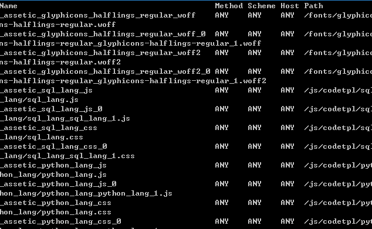
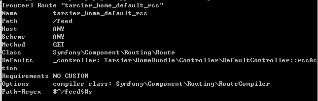

# Symfony2 Jobeet Day 5: 路由控制

## URL
如果你点击 Jobeet 主页上的职位，该 URL 看起来像这样 ︰ /job/1/show。如果你曾经开发过PHP网站，你可能更习惯于像 /job.php?id=1这样的格式。然而Symfony是如何使URL工作的呢?又是如何确定调用相应的action呢？又为什么能将参数id能传递给action呢？下面我们将回答这些问题。

我想你已经在 src/Ens/JobeetBundle/Resources/views/Job/index.html.twig 模板中见过了如下代码 ︰

> {{ path('ens_job_show', { 'id': entity.id }) }}

此处使用模板的 path函数生成一个url路径，ens_job_show是路由的名称，具体的配置将在稍后展示

## 路由配置
在 Symfony2中，通常是将指定包的路由配置文件导入app/config/routing.yml文件。在我们这个例子中就是src/Ens/JobeetBundle/Resources/config/routing.yml

```yaml
#app/config/routing.yml
 
EnsJobeetBundle:
    resource: "@EnsJobeetBundle/Resources/config/routing.yml"
    prefix:   /
```

现在你打开JobeetBundle的routing.yml可以看到两个路由，一个Job的控制器路由和一个默认的EnsJobeetBundle_homepage的路由---/hello/{name}

```yaml
#src/Ens/JobeetBundle/Resources/config/routing.yml
 
EnsJobeetBundle_job:
    resource: "@EnsJobeetBundle/Resources/config/routing/job.yml"
    prefix: /job
 
EnsJobeetBundle_homepage:
    pattern:  /hello/{name}
    defaults: { _controller: EnsJobeetBundle:Default:index }
```

再打开job.yml查看job的路由

```yaml
#src/Ens/JobeetBundle/Resources/config/routing/job.yml
 
ens_job:
    pattern:  /
    defaults: { _controller: "EnsJobeetBundle:Job:index" }
 
ens_job_show:
    pattern:  /{id}/show
    defaults: { _controller: "EnsJobeetBundle:Job:show" }
 
ens_job_new:
    pattern:  /new
    defaults: { _controller: "EnsJobeetBundle:Job:new" }
 
ens_job_create:
    pattern:  /create
    defaults: { _controller: "EnsJobeetBundle:Job:create" }
    requirements: { _method: post }
 
ens_job_edit:
    pattern:  /{id}/edit
    defaults: { _controller: "EnsJobeetBundle:Job:edit" }
 
ens_job_update:
    pattern:  /{id}/update
    defaults: { _controller: "EnsJobeetBundle:Job:update" }
    requirements: { _method: post }
 
ens_job_delete:
    pattern:  /{id}/delete
    defaults: { _controller: "EnsJobeetBundle:Job:delete" }
    requirements: { _method: post }
```

现在让我们仔细研究下ens_job_show路由。它通过通配符匹配形如/*/show的路径，并将参数赋值给id。如URL /1/show，则 id 变量获取的值就为 1
_controller 参数是告诉 Symfony 在URL 匹配这条路由后，应该选择哪个控制器下的哪个action。在我们的例子中就是在我们的例子中，就是 EnsJobeetBundle 的JobController 下执行 showAction方法

路由参数 (例如 {id}) 非常重要，因为它将把每个参数传递给控制器的action方法，比如

```php
public function showAction($id)
{
    // ...
}
```

## 在开发环境配置路由

在开发环境加载app/config/routing_dev.yml文件将会包含使用web开发调试栏所需的路由。而且在这个文件的末尾我们能看到_main包含了routing.yml中配置。

如果你此时用浏览器访问http://jobeet.local/app_dev.php看到的将会是Symfony的默认页面，现在让我们来做些小小的改变，使得在开发环境和未来的生产环境相一致。打开你的app/config/routing_dev.yml文件并移除最开始的三行Symfony demo bundle的路由。修改之后看起来应该是这样的：

```yaml
#app/config/routing_dev.yml
 
_assetic:
    resource: .
    type:     assetic
 
_wdt:
    resource: "@WebProfilerBundle/Resources/config/routing/wdt.xml"
    prefix:   /_wdt
 
_profiler:
    resource: "@WebProfilerBundle/Resources/config/routing/profiler.xml"
    prefix:   /_profiler
 
_configurator:
    resource: "@SensioDistributionBundle/Resources/config/routing/webconfigurator.xml"
    prefix:   /_configurator
 
_main:
    resource: routing.yml
```

当然别忘了清除你的缓存

自定义路由

现在当你迫不及待的打开浏览器准备见证奇迹的时候，很不幸，我想你会遇到一个404页面<_< 这是因为没有任何已定义的路由被匹配到。之前我们已经有了一个名为EnsJobeetBundle_homepage的路由，但很可惜它匹配到的是/hello/jobeet这个url并执行DefaultController的index方法。现在让我们来匹配根目录（/），并调用JobController的index方法。修改如下：

```yaml
#src/Ens/JobeetBundle/Resources/config/routing.yml
#...
 
EnsJobeetBundle_homepage:
    pattern:  /
    defaults: { _controller: EnsJobeetBundle:Job:index }
```

好了，现在你可以打开浏览器输入http://jobeet.local见证奇迹的发生了
现在我们修改一下Jobeet logo的链接为EnsJobeetBundle_homepage

```html
<!-- src/Ens/JobeetBundle/Resources/views/layout.html.twig -->
<!-- ... -->
<h1><a href="{{ path('EnsJobeetBundle_homepage') }}">
  
</a></h1>
<!-- ... -->
```

让我们再做些微的改变，使得职位页的url显得更有意义，比如

> /job/sensio-labs/paris-france/1/web-developer

你不需要知道任何关于Jobeet和页面的内容，仅从URL就能知道Sensio Labs正在巴黎寻找一名web开发工程师

它匹配如下的URL

> /job/{company}/{location}/{id}/{position}

编辑job.yml的ens_job_show项:

```yaml
#src/Ens/JobeetBundle/Resources/config/routing/job.yml
#...
 
ens_job_show:
    pattern:  /{company}/{location}/{id}/{position}
    defaults: { _controller: "EnsJobeetBundle:Job:show" }
```

不过你现在不得不修改一下URL的参数才能使它正常工作：

```html
<!-- src/Ens/JobeetBundle/Resources/views/Job/index.html.twig -->
<!-- ... -->
<a href="{{ path('ens_job_show', { 'id': entity.id, 'company': entity.company, 'location': entity.location, 'position': entity.position }) }}">
  {{ entity.position }}
</a>
<!-- ... -->
```

然而，是的，我又说了然而，你别高兴的太早，如果此时你查看生成的URL的话会发现它其实是这样的：

> http://jobeet.local/job/Sensio Labs/Paris, France/1/Web Developer

我们必须使用"slugify"方法将所有非ASCII码的值替换为 - 。
打开Job.php,添加如下代码：

```php
// src/Ens/JobeetBundle/Entity/Job.php
// ...
 
use Ens\JobeetBundle\Utils\Jobeet as Jobeet;
class Job
{
    // ...
    public function getCompanySlug()
    {
        return Jobeet::slugify($this->getCompany());
    }
 
    public function getPositionSlug()
    {
        return Jobeet::slugify($this->getPosition());
    }
 
    public function getLocationSlug()
    {
        return Jobeet::slugify($this->getLocation());
    }
}
```

然后创建src/Ens/JobeetBundle/Utils/Jobeet.php文件，并在其中添加slugify方法：

```php
// src/Ens/JobeetBundle/Utils/Jobeet.php
 
namespace Ens\JobeetBundle\Utils;
class Jobeet
{
    static public function slugify($text)
    {
        // replace all non letters or digits by -
        $text = preg_replace('/\W+/', '-', $text);
 
        // trim and lowercase
        $text = strtolower(trim($text, '-'));
 
        return $text;
    }
}
```

我们添加了三个新的“虚拟”属性访问，分别是getCompanySlug(), getPositionSlug(), 和getLocationSlug()，它们将返回被slugify方法处理过的值，现在把模板中的三个真实属性替换为这三个虚拟属性：

```html
<!-- src /JobeetBundle/Resources/views/Job/index.html.twig -->
<!-- ... -->
<a href="{{ path('ens_job_show', { 'id': entity.id, 'company': entity.companyslug, 'location': entity.locationslug, 'position': entity.positionslug}) }}">
  {{ entity.position }}
</a>
<!-- ... -->
```

此刻你的URL看上去应该像这样：

> http://jobeet.local/app_dev.php/job/sensio-labs/paris-france/1/web-developer
 
## 路由验证
有时候你需要限制路由中参数的类型，此时就可以通过路由系统中内置的验证功能来实现。使用方法很简单，就是在每个参数里面定义一个正则表达式，比如：

```yaml
#src/Ens/JobeetBundle/Resources/config/routing/job.yml
#...
 
ens_job_show:
    pattern:  /{company}/{location}/{id}/{position}
    defaults: { _controller: "EnsJobeetBundle:Job:show" }
    requirements:
        id:  \d+
```

这将保证传入的id一定为一个数字，否则该路由将不能匹配

## 路由调试

当你路由数量多到一定程度的时候你总会希望能看到究竟有哪些路由在起作用，此时router:debug命令可以帮到你，在网站的根目录输入：

> **php app/console router:debug**

这个命令将会输出你该项目所有的路由配置，类似下图：
 

你也能对单个路由进行解析，获取其详细信息

> **php app/console router:debug ens_job_show**


 

## 反思
这就是今天的所有东西了，如果你希望能了解更多有关于Symfony的知识，请前往官网路由这一章查看

## Annotation生成路由

上面介绍的都是Symfony使用yml来配置路由，在现实开发中比较常见的是使用Annotations方式，这里简单介绍一下：
Annotation是指用注释的方法来生成路由，简单说就是在action之前添加固定格式的注释来实现路由解析。
Annotation一般是/**开头 */结尾的注释
一般常用参数有
Route，ParamConverter，Method和Template
具体如下

```php
/**
*@Route("/{id}/show/",defaults={"id":1},requirements={"id"="\d+"})
  * @ParamConverter("job",class="JobeetBundle:job")
  * @Method("GET")
  * @Template()
*/
```

其中Route表示路由，参数和yml是一样的，其中defaults表示如果参数不存在则默认值为多少。
ParamConverter用于将参数直接转化为数据对象，默认是将通过id直接寻找结果对象。接收三个参数，第一个是获取对象之后的变量名，第二个是Model类对象，第三个是option。由于option的功能过于灵活，所以可以参考官网来学习，此处不展开
对于多个参数可以使用多个ParamConverter，且每个都会生成一个独立的对象。生成的对象在传入action时需要将action修改成showAction(Job $job)。之后你就可以在action中直接使用$job这个对象了。
Method用于指定该Action所能匹配的方法，比如填写了GET，则POST到该路径时将无法找到。
Template表示使用的模板，当需要更换模板，或者模板名称与action名称不一致时使用，比如JobeetBundle:Default:show2.html.twig

当你需要对整个控制器定义一个总路由前缀的时候，只要在类外写一个Route参数就可以了，比如

```php
/**
 * @Route("/user")
 */
class DefaultController extends WxBaseController
{


    /**
     * @Route("/hello/{name}",defaults={"name":"what's your name?"})
     * @Template()
     */
//…
}
```
则此时路由访问的URL应该为/user/hello/XXX
该方法适用于统一路径的控制器，比如用户中心等。